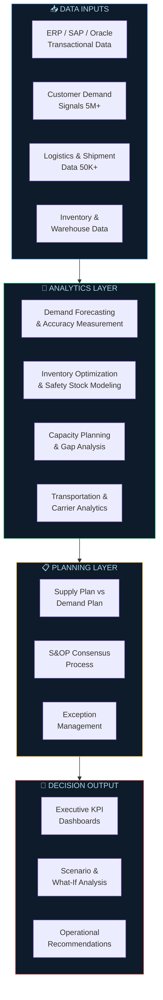
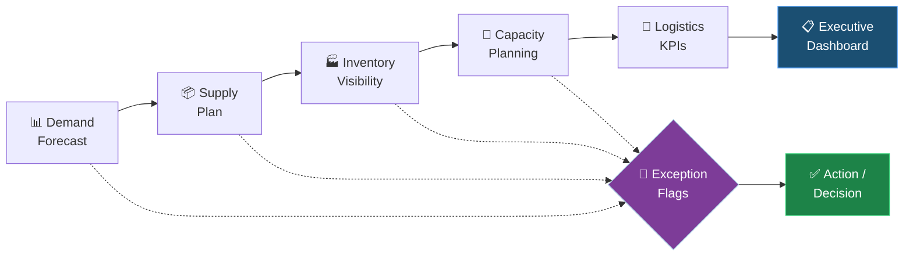
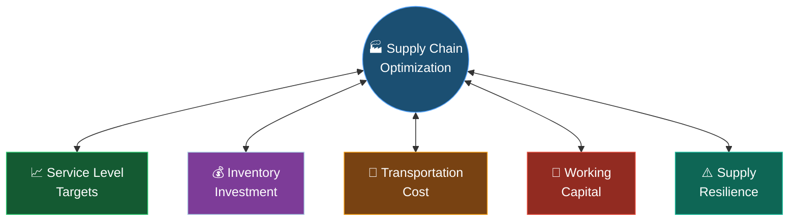
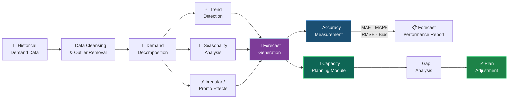

<!-- ══════════════════════════════════════════════════════════════════ -->
<!--  ANIMATED WAVING HEADER — CAPSULE RENDER                          -->
<!-- ══════════════════════════════════════════════════════════════════ -->


<div align="center">

<!-- ══════════════════════════════════════════════════════════════════ -->
<!--  ANIMATED TYPING SVG — ROLE CAROUSEL                              -->
<!-- ══════════════════════════════════════════════════════════════════ -->


<br /><br />

<!-- ══════════════════════════════════════════════════════════════════ -->
<!--  SOCIAL + STATUS BADGES                                          -->
<!-- ══════════════════════════════════════════════════════════════════ -->

<a href="https://www.linkedin.com/in/shivani-joshi-scm/">
  
</a>
&nbsp;
<a href="mailto:YOUR_EMAIL">
  
</a>
&nbsp;
<a href="PORTFOLIO_LINK">
  
</a>
&nbsp;


<br /><br />


</div>

<br />

<!-- ANIMATED RAINBOW SEPARATOR -->


---

<!-- ══════════════════════════════════════════════════════════════════ -->
<!--  ABOUT ME — TWO-COLUMN LAYOUT                                     -->
<!-- ══════════════════════════════════════════════════════════════════ -->

<table>
<tr>
<td width="56%" valign="top">

## 🧭 About Me

I work at the intersection of **supply chain planning, analytics, and decision intelligence** — transforming raw operational data into executable plans and executive decisions.

```yaml
Name        : Shivani Joshi
Role        : Supply Chain Analyst
Focus       : S&OP · Demand Planning · Inventory Optimization
Current     : Kroger
Past        : Total Quality Logistics · Mphasis
Tools       : Power BI · Excel · SAP · Oracle · Tableau
Data Scale  : 5M+ demand signals · 50K+ weekly shipments
              30K+ units/day distribution planning
Superpower  : Raw Data → Plan → Executive Decision
Status      : 🟢 Open to New Opportunities
````

</td>
<td width="44%" align="center" valign="middle">

<!-- 🔁 Replace with your own analytics/supply chain themed GIF -->


</td>
</tr>
</table>

<br />


---

<!-- ══════════════════════════════════════════════════════════════════ -->

<!--  WHAT I DO — CAPABILITY GRID                                      -->

<!-- ══════════════════════════════════════════════════════════════════ -->

## ⚡ What I Do

<div align="center">

|                                📊 Demand Planning                               |                                   🔄 S&OP / IBP                                  |                         📦 Supply Planning                         |
| :-----------------------------------------------------------------------------: | :------------------------------------------------------------------------------: | :----------------------------------------------------------------: |
| Trend & seasonality analysis, statistical forecasting, forecast accuracy & bias | Consensus planning, cross-functional alignment, executive review, scenario decks | Supply-demand balancing, replenishment logic, constrained planning |

|                                 🏭 Inventory Optimization                                 |                        🚛 Transportation Analytics                        |                           📐 Capacity Planning                          |
| :---------------------------------------------------------------------------------------: | :-----------------------------------------------------------------------: | :---------------------------------------------------------------------: |
| Safety stock modeling, reorder points, multi-echelon inventory, working capital tradeoffs | Shipment analysis, carrier KPIs, lane performance, freight cost analytics | Demand-driven capacity, constraint identification, peak-period planning |

|                      🏬 Warehouse & Distribution                     |                  🤝 Supplier Performance                  | 📈 Supply Chain KPIs                                                          |
| :------------------------------------------------------------------: | :-------------------------------------------------------: | :---------------------------------------------------------------------------- |
| Throughput analysis, DC allocation, inbound/outbound flow visibility | On-time delivery, lead time variance, supplier scorecards | OTIF, fill rate, inventory turns — from measurement to root-cause to decision |

|                              🧪 Scenario Analysis                             |                                 ⚙️ Process Automation                                | 📋 Executive Reporting                                                  |
| :---------------------------------------------------------------------------: | :----------------------------------------------------------------------------------: | :---------------------------------------------------------------------- |
| What-if modeling, risk scenarios, sensitivity analysis, planning alternatives | Automated reporting pipelines, recurring KPI refresh, Excel / Power Query automation | Leadership-ready dashboards, exception-based reporting, S&OP narratives |

</div>

<br />


---

<!-- ══════════════════════════════════════════════════════════════════ -->

<!--  FROM DATA TO DECISION — ANIMATED MERMAID DIAGRAMS                -->

<!-- ══════════════════════════════════════════════════════════════════ -->

## 🔁 From Data to Decision

> Every project, dashboard, and model I build is anchored to a **business decision** — not just a metric.




<br />


---

<!-- ══════════════════════════════════════════════════════════════════ -->

<!--  FEATURED PROJECTS SECTION HEADER — CAPSULE RENDER RECT           -->

<!-- ══════════════════════════════════════════════════════════════════ -->

<div align="center">


<br />

**Portfolio projects built to demonstrate real-world supply chain planning, optimization, analytics, and decision-support capabilities.**<br/>
*These are independent projects and are not associated with any employer.*

</div>

---

<!-- ══════════════════════════════════════════════════════════════════ -->

<!--  PROJECT 1 — CONTROL TOWER (COLLAPSIBLE)                         -->

<!-- ══════════════════════════════════════════════════════════════════ -->

<details>
<summary><h3>📡 &nbsp; Project 1 — End-to-End Supply Chain Control Tower &amp; S&amp;OP Decision Platform &nbsp; </h3></summary>

<br />

<div align="center">


</div>

**🔍 Problem**

> Supply chain leaders rarely have a single, integrated view of demand, supply, inventory, capacity, and logistics. Planning decisions are made from fragmented data — leading to blind spots, misaligned plans, and reactive firefighting.

**🎯 Business Objective**

> Provide S&OP teams with a unified, exception-driven decision platform connecting every layer of the supply chain — from demand signals through to operational execution.

**🛠 Architecture**



**⚙️ Key Capabilities**

| Capability              | Description                                             |
| ----------------------- | ------------------------------------------------------- |
| 📊 Demand Visibility    | Forecast vs. actuals, bias tracking, exception flagging |
| 📦 Supply-Demand Gap    | Supply plan vs. demand plan alignment view              |
| 🏭 Inventory Position   | SKU / node / category inventory visibility              |
| 🛡 Safety Stock Monitor | Coverage analysis, overstock / stockout risk            |
| 📐 Capacity Utilization | Demand-driven capacity vs. operational constraints      |
| 🚛 Transportation KPIs  | Carrier performance, OTIF, lead time variance           |
| 🚨 Exception Management | Automated deviation flags requiring planner action      |
| 🧪 Scenario Analysis    | Planning alternatives for structured S&OP review        |
| 📋 Executive Reporting  | Leadership-ready S&OP narrative and summary layer       |

**💻 Technology Stack**


**📁 Repository Structure**

```text
supply-chain-control-tower/
├── 📄 README.md
├── 📂 data/
│   ├── demand/               ← Demand signals, forecasts, actuals
│   ├── supply/               ← Supply plans, purchase orders
│   ├── inventory/            ← Stock positions by node & SKU
│   ├── capacity/             ← Capacity data by resource & period
│   └── logistics/            ← Shipment, carrier & OTIF data
├── 📂 dashboards/
│   ├── demand-forecast/      ← Forecast vs. actual dashboards
│   ├── supply-plan/          ← Supply-demand alignment views
│   ├── inventory-visibility/
│   ├── capacity-planning/
│   ├── logistics-kpi/
│   ├── kpi-dashboard/        ← Master KPI view
│   └── executive-dashboard/  ← S&OP executive summary
├── 📂 models/                ← Forecasting & planning models
├── 📂 outputs/               ← Scenario outputs & reports
├── 📂 documentation/         ← Methodology & data dictionary
└── 📂 screenshots/           ← Dashboard previews
```

**📈 Business Impact**

> Enables supply chain teams to shift from **reactive data retrieval to proactive exception management**, supporting structured S&OP reviews with cross-functional visibility across demand, supply, inventory, capacity, and logistics in a single platform.

<div align="center">

**[🔗 View Project →](PROJECT_LINK)**

</div>

</details>

---

<!-- ══════════════════════════════════════════════════════════════════ -->

<!--  PROJECT 2 — INVENTORY OPTIMIZATION (COLLAPSIBLE)                 -->

<!-- ══════════════════════════════════════════════════════════════════ -->

<details>
<summary><h3>🏭 &nbsp; Project 2 — Multi-Echelon Inventory &amp; Network Optimization Engine &nbsp; </h3></summary>

<br />

<div align="center">


</div>

**🔍 Problem**

> Inventory optimization is not about minimizing stock. It requires balancing competing pressures — service level, inventory cost, transportation cost, working capital, and supply variability — across multiple network nodes simultaneously.

**🎯 Business Objective**

> Help supply chain planners evaluate inventory positioning, safety stock levels, and network configurations across echelons — with full visibility into cost / service / capital tradeoffs for each scenario.

**⚖️ Core Tradeoff Architecture**



**⚙️ Key Capabilities**

| Module                     | Capability                                               |
| -------------------------- | -------------------------------------------------------- |
| 🏭 Multi-Echelon Modeling  | Plant → DC → Store / Customer inventory optimization     |
| 🛡 Safety Stock Engine     | Calculation by node using demand variability & lead time |
| 🎯 Reorder Point Logic     | Service-level sensitivity and parameter optimization     |
| 📊 Service-Level Tradeoffs | Inventory investment vs. service level curves            |
| 💰 Carrying Cost Analysis  | Inventory carrying cost by node and SKU class            |
| 🌐 Network Scenarios       | Centralized vs. decentralized inventory comparison       |
| 🚛 Transportation Analysis | Cost by lane, mode, and network configuration            |
| 🏬 DC Allocation           | Warehouse assignment and distribution flow optimization  |
| 🏦 Working Capital Impact  | Working capital implications by network scenario         |
| 📋 Recommendations         | Inventory positioning recommendations with rationale     |

**💻 Technology Stack**


**📁 Repository Structure**

```text
inventory-network-optimization/
├── 📄 README.md
├── 📂 data/
│   ├── demand-history/         ← Historical demand by SKU & node
│   ├── lead-times/             ← Supplier & internal lead times
│   ├── network-nodes/          ← DC, plant, store master data
│   └── transportation-costs/   ← Lane rates and freight data
├── 📂 models/
│   ├── safety-stock/           ← Safety stock optimization models
│   ├── reorder-point/          ← ROP calculations by node
│   ├── service-level/          ← Service level tradeoff models
│   └── network-scenarios/      ← Network configuration scenarios
├── 📂 dashboards/
│   ├── inventory-by-node/
│   ├── service-level-tradeoffs/
│   ├── transportation-cost/
│   └── scenario-comparison/
├── 📂 outputs/
├── 📂 documentation/
└── 📂 screenshots/
```

**📈 Business Impact**

> Enables inventory and network planning teams to make evidence-based decisions about **where to hold inventory, how much, and what service level is achievable** — given transportation and working capital constraints — rather than relying on static rules-of-thumb.

<div align="center">

**[🔗 View Project →](PROJECT_LINK)**

</div>

</details>

---

<!-- ══════════════════════════════════════════════════════════════════ -->

<!--  PROJECT 3 — AI FORECASTING (COLLAPSIBLE)                         -->

<!-- ══════════════════════════════════════════════════════════════════ -->

<details>
<summary><h3>🤖 &nbsp; Project 3 — AI-Powered Demand Forecasting &amp; Capacity Planning System &nbsp; </h3></summary>

<br />

<div align="center">


</div>

**🔍 Problem**

> Traditional statistical forecasting often fails to capture complex demand patterns driven by seasonality, promotions, and trend shifts. Without accurate forecasts, capacity planning becomes reactive — leading to over/under-capacity and poor service levels.

**🎯 Business Objective**

> Improve forecast accuracy using AI/ML-enhanced techniques and feed those forecasts into a capacity planning framework — identifying supply-demand gaps, peak-period risks, and what-if planning scenarios.

**🛠 Forecasting Pipeline**



**📐 Forecast Accuracy Metrics**

<div align="center">

|  Metric  |            Full Name           | Purpose                                       |
| :------: | :----------------------------: | :-------------------------------------------- |
|  **MAE** |       Mean Absolute Error      | Average forecast error magnitude              |
| **MAPE** | Mean Absolute Percentage Error | Percentage error — intuitive to communicate   |
| **RMSE** |     Root Mean Squared Error    | Penalizes large forecast errors more heavily  |
| **Bias** |          Forecast Bias         | Detects systematic over- or under-forecasting |

</div>

**⚙️ Key Capabilities**

**📊 Demand Forecasting Module**

* Historical demand analysis and statistical cleansing
* Trend detection and time-series decomposition
* Seasonality pattern identification and modeling
* AI/ML-enhanced forecast generation
* Forecast accuracy measurement: MAE, MAPE, RMSE, Bias
* Demand scenario modeling (base / upside / downside)

**📐 Capacity Planning Module**

* Demand-driven capacity requirements by period and resource
* Capacity utilization tracking and constraint identification
* Supply-demand gap flagging and peak-period risk analysis
* Constrained vs. unconstrained plan comparison
* What-if analysis across demand scenarios

**💻 Technology Stack**


**📁 Repository Structure**

```text
demand-forecasting-capacity-planning/
├── 📄 README.md
├── 📂 data/
│   ├── demand-history/        ← Cleaned historical demand data
│   ├── external-signals/      ← Seasonality calendars & event flags
│   └── capacity-data/         ← Capacity by resource & period
├── 📂 models/
│   ├── forecasting/           ← Forecast model configurations
│   ├── accuracy-metrics/      ← MAE, MAPE, RMSE, Bias tracking
│   └── capacity-planning/     ← Capacity requirement models
├── 📂 dashboards/
│   ├── demand-forecast/       ← Forecast vs. actual views
│   ├── forecast-accuracy/     ← Accuracy & bias monitoring
│   ├── capacity-utilization/
│   └── scenario-analysis/
├── 📂 outputs/
├── 📂 documentation/
└── 📂 screenshots/
```

**📈 Business Impact**

> Provides planning teams with a structured forecasting framework that measures accuracy, quantifies bias, and feeds forward-looking demand signals into capacity decisions — enabling more proactive supply planning and better peak-period readiness.

<div align="center">

**[🔗 View Project →](https://github.com/shivani-scm)**

</div>

</details>

<br />


---

<!-- ══════════════════════════════════════════════════════════════════ -->

<!--  TECHNOLOGY STACK                                                 -->

<!-- ══════════════════════════════════════════════════════════════════ -->

## 🛠 Technology Stack

<div align="center">

### 📊 Analytics & Business Intelligence


### 🏢 ERP & Enterprise Systems


### 🔗 Supply Chain Planning Capabilities


</div>

<br />


---

<!-- ══════════════════════════════════════════════════════════════════ -->

<!--  SUPPLY CHAIN KPI SECTION                                         -->

<!-- ══════════════════════════════════════════════════════════════════ -->

## 📊 Supply Chain KPIs I Work With

> The goal is not just to *report* KPIs — it's to use them to **identify exceptions, diagnose root causes, and drive decisions**.

<div align="center">

|     Category     |          KPI         | How I Use It                                                                |
| :--------------: | :------------------: | :-------------------------------------------------------------------------- |
|  🚚 **Service**  |         OTIF         | Exception flagging, root-cause diagnosis, carrier / supplier accountability |
|  🚚 **Service**  |       Fill Rate      | Order fulfillment gap analysis, inventory adequacy review                   |
|  🚚 **Service**  |     Service Level    | Inventory policy evaluation, safety stock calibration                       |
| 📦 **Inventory** |    Inventory Turns   | Working capital efficiency, slow-mover identification                       |
| 📦 **Inventory** | Days of Supply (DOS) | Coverage analysis, overstock / stockout risk flagging                       |
|  🔮 **Forecast** |   Forecast Accuracy  | Bias and error tracking, model performance monitoring                       |
|  🔮 **Forecast** |     Forecast Bias    | Systematic over/under-forecast identification                               |
|  📐 **Capacity** | Capacity Utilization | Peak-period risk, operational constraint planning                           |
|  📐 **Capacity** |      Throughput      | Operational throughput analysis, bottleneck identification                  |
|  ⏱ **Lead Time** |  Lead Time Variance  | Supplier / carrier variance, planning buffer calibration                    |
|  🤝 **Supplier** |   On-Time Delivery   | Supplier scorecard, supply risk monitoring                                  |

</div>

<br />


---

<!-- ══════════════════════════════════════════════════════════════════ -->

<!--  GITHUB STATS — ANIMATED CARDS                                    -->

<!-- ══════════════════════════════════════════════════════════════════ -->

## 📈 GitHub Stats

<div align="center">

<table>
  <tr>
    <td align="center">
      
    </td>
    <td align="center">
      
    </td>
  </tr>
</table>

<br />

<!-- GITHUB TROPHIES -->


</div>

<br />

<!-- ACTIVITY GRAPH — FULL WIDTH -->


<br />

<!-- ══════════════════════════════════════════════════════════════════ -->

<!--  SNAKE ANIMATION                                                  -->

<!--  Requires .github/workflows/snake.yml in this profile repo       -->

<!-- ══════════════════════════════════════════════════════════════════ -->

<div align="center">

<picture>
  <source
    media="(prefers-color-scheme: dark)"
    srcset="https://raw.githubusercontent.com/shivani-scm/shivani-scm/output/github-contribution-grid-snake-dark.svg"
  />
  <source
    media="(prefers-color-scheme: light)"
    srcset="https://raw.githubusercontent.com/shivani-scm/shivani-scm/output/github-contribution-grid-snake.svg"
  />
  
</picture>

</div>


---

<!-- ══════════════════════════════════════════════════════════════════ -->

<!--  PROFESSIONAL EXPERIENCE — COLLAPSIBLE                            -->

<!-- ══════════════════════════════════════════════════════════════════ -->

<details>
<summary><h2>💼 &nbsp; Professional Experience Snapshot</h2></summary>

<br />

> Full experience available on [LinkedIn](https://www.linkedin.com/in/shivani-joshi-scm/)

---

### 🏪 Supply Chain Analyst — Kroger *(Current)*

Working within a large-scale retail supply chain with exposure to complex demand and distribution planning at scale:

* Managed planning processes encompassing **5M+ customer demand signals**
* Supported distribution planning involving **30K+ units/day**
* Built and maintained **Power BI KPI dashboards** for supply chain performance monitoring
* Supported **S&OP / IBP processes** — forecast review, supply-demand balancing, and executive reporting
* Automated recurring reporting workflows using **Power BI and Advanced Excel / Power Query**
* Worked with **SAP and Oracle** ERP environments for supply chain data extraction and analysis
* Collaborated cross-functionally with operations, procurement, finance, and commercial teams
* Conducted **root-cause analysis** on service and inventory exceptions

---

### 🚛 Supply Chain / Logistics Analyst — Total Quality Logistics

* Analyzed **50K+ weekly truckload shipments** for logistics performance monitoring
* Supported transportation analytics — carrier performance, lane analysis, and freight cost visibility
* Delivered KPI reporting and exception management for logistics operations
* Worked cross-functionally with carrier relations, operations, and commercial teams

---

### 🏢 Supply Chain Analyst — Mphasis

* Earlier supply chain and analytical experience supporting planning and operational decision-making
* Built foundational expertise in supply chain data, reporting, and cross-functional coordination

</details>

---

<!-- ══════════════════════════════════════════════════════════════════ -->

<!--  PHILOSOPHY — COLLAPSIBLE                                         -->

<!-- ══════════════════════════════════════════════════════════════════ -->

<details>
<summary><h2>🧠 &nbsp; How I Approach Supply Chain Problems</h2></summary>

<br />

```text
╔══════════════════════════════════════════════════════════════════════════╗
║  SUPPLY CHAIN PROBLEM-SOLVING FRAMEWORK                                ║
╠══════════════════════════════════════════════════════════════════════════╣
║                                                                        ║
║  1. START WITH THE BUSINESS PROBLEM                                    ║
║     Every analysis answers a question a supply chain leader is asking —║
║     not a question that is easy to answer with available data.         ║
║                                                                        ║
║  2. CONVERT OPERATIONAL DATA INTO MEASURABLE INSIGHTS                 ║
║     Raw demand signals, ERP extracts, and shipment records become      ║
║     meaningful only when structured around a decision.                 ║
║                                                                        ║
║  3. BALANCE COST, SERVICE, INVENTORY, AND CAPACITY                    ║
║     Every supply chain decision involves tradeoffs — and the best      ║
║     plans make those tradeoffs explicit, not invisible.                ║
║                                                                        ║
║  4. USE SCENARIOS TO UNDERSTAND TRADEOFFS AND RISK                    ║
║     A single plan is a guess. A scenario set is a decision framework.  ║
║     Good planning quantifies the upside, downside, and risk.           ║
║                                                                        ║
║  5. TURN ANALYTICS INTO DECISIONS, NOT JUST DASHBOARDS                ║
║     A dashboard showing what happened is useful.                      ║
║     A platform showing what to do next is valuable.                    ║
║                                                                        ║
╚══════════════════════════════════════════════════════════════════════════╝
```

</details>

<br />


---

<!-- ══════════════════════════════════════════════════════════════════ -->

<!--  CONNECT                                                          -->

<!-- ══════════════════════════════════════════════════════════════════ -->

## 🤝 Let's Connect

<div align="center">

Open to opportunities in **Supply Chain Planning · S&OP · Demand Forecasting · Inventory Optimization · Logistics Analytics · Supply Chain Transformation**

<br />

<a href="https://www.linkedin.com/in/shivani-joshi-scm/">
  
</a>
&nbsp;
<a href="mailto:shivanijoshi673@gmail.com">
  
</a>
&nbsp;
<a href="https://github.com/shivani-scm">
  
</a>
&nbsp;
<a href="https://github.com/shivani-scm">
  
</a>

<br /><br />

</div>

<!-- ══════════════════════════════════════════════════════════════════ -->

<!--  ANIMATED WAVING FOOTER — CAPSULE RENDER                         -->

<!-- ══════════════════════════════════════════════════════════════════ -->


<div align="center">

*Supply Chain Analytics · S&OP · Demand Planning · Inventory Optimization · Logistics · Decision Intelligence*

</div>

---

<!--
══════════════════════════════════════════════════════════════════════════
  SETUP CHECKLIST
══════════════════════════════════════════════════════════════════════════
  [ ] YOUR_EMAIL      → replace with your professional email address
  [ ] PORTFOLIO_LINK  → replace with your portfolio URL
  [ ] PROJECT_LINK    → replace with the actual project repository URL
  [ ] Verify all external image URLs render correctly

  SNAKE ANIMATION:
  Create:
      .github/workflows/snake.yml

  The workflow must generate:
      output/github-contribution-grid-snake.svg
      output/github-contribution-grid-snake-dark.svg

  Then the README references will work automatically.

  IMPORTANT:
  GitHub Stats uses only public statistics on the public hosted instance.
  Private statistics require your own deployed instance / token.
══════════════════════════════════════════════════════════════════════════
-->


